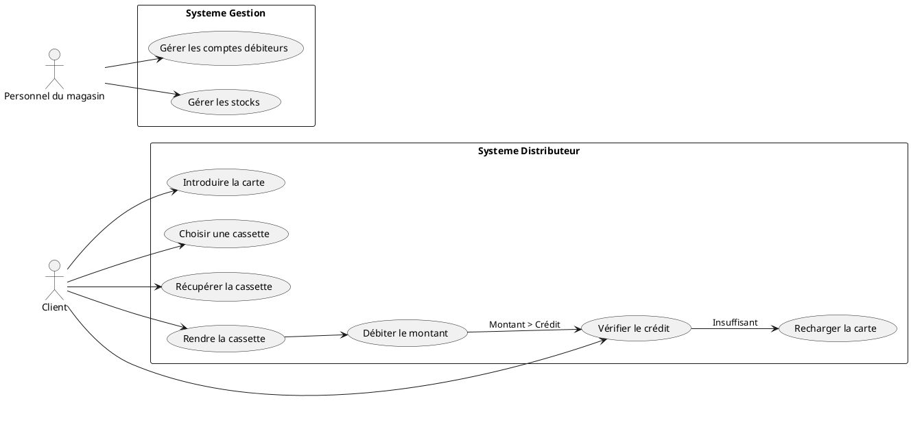

# TD 1 - Le langage UML – La vue fonctionnelle

## Diagramme de cas d’utilisation

Pour visualiser le diagramme, veuillez utiliser le site https://www.planttext.com/

## Scénarios du Cas d'Utilisation « Emprunter une Cassette Vidéo »

### Scénario Principal : Emprunter une Cassette Vidéo

1. **Initiation du processus** :
   - L'utilisateur (Client) approche du distributeur automatique de cassettes vidéo.
  
2. **Introduction de la carte** :
   - Le Client insère sa carte magnétique dans le distributeur.
  
3. **Vérification du crédit** :
   - Le système vérifie le solde disponible sur la carte.
   - **Condition** : Si le crédit est supérieur ou égal à 2D (montant requis pour louer une cassette), le processus continue.
   - **Condition alternative** : Si le crédit est inférieur à 2D, le Client est informé qu'il doit recharger sa carte au magasin.

4. **Sélection de la cassette** :
   - Le Client parcourt les cassettes disponibles dans le distributeur.
   - Le Client sélectionne une cassette à emprunter.

5. **Récupération de la cassette** :
   - Le distributeur délivre la cassette sélectionnée au Client.

6. **Confirmation de la location** :
   - Le système met à jour le solde de la carte du Client en déduisant le montant de la location.
   - Le Client reçoit une confirmation de la location (par exemple, un reçu ou un message à l'écran).

7. **Fin du processus** :
   - Le Client prend la cassette et quitte le distributeur.

### Scénarios Alternatifs

#### Scénario Alternatif 1 : Crédit Insuffisant

- **Condition déclenchante** : Le Client insère sa carte.
- **Événement** : Le système vérifie le crédit et trouve qu'il est insuffisant.
- **Action** : Le Client est informé par un message à l'écran qu'il doit recharger sa carte.
- **Fin du scénario** : Le Client quitte le distributeur pour recharger sa carte au magasin.

#### Scénario Alternatif 2 : Erreur lors de la Sélection de la Cassette

- **Condition déclenchante** : Le Client sélectionne une cassette.
- **Événement** : Le système rencontre un problème (par exemple, la cassette est en panne ou non disponible).
- **Action** : Le Client est informé que la cassette sélectionnée n'est pas disponible.
- **Action additionnelle** : Le Client peut choisir une autre cassette ou quitter le distributeur.
- **Fin du scénario** : Le Client poursuit ou abandonne la location.

#### Scénario Alternatif 3 : Problème lors du Débit

- **Condition déclenchante** : Le Client a réussi à récupérer la cassette.
- **Événement** : Lors du débit du montant de la location, le système rencontre une erreur (par exemple, une panne technique).
- **Action** : Le Client est informé qu'il y a eu un problème lors du débit.
- **Action additionnelle** : Le Client peut être invité à réessayer ou à contacter le personnel du magasin.
- **Fin du scénario** : Le Client peut tenter de relouer la cassette ou abandonner l'opération.

### Conclusion

Ces scénarios décrivent les différentes étapes et variations qui peuvent survenir lors du processus d'emprunt d'une cassette vidéo à partir d'un distributeur automatique. Ils permettent de couvrir à la fois le flux principal d'interaction et les exceptions potentielles qui pourraient survenir.

