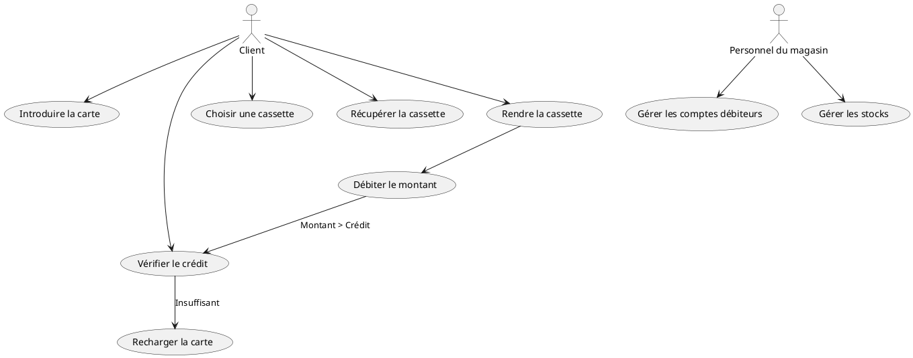

# TD 1 - Le langage UML – La vue fonctionnelle

## Diagramme de cas d’utilisation

```puml
@startuml
actor Client
actor Magasin as "Personnel du magasin"

usecase "Introduire la carte" as UC_IntroduireCarte
usecase "Vérifier le crédit" as UC_VerifierCredit
usecase "Choisir une cassette" as UC_ChoisirCassette
usecase "Récupérer la cassette" as UC_RecupererCassette
usecase "Rendre la cassette" as UC_RendreCassette
usecase "Débiter le montant" as UC_DebiterMontant
usecase "Recharger la carte" as UC_RechargerCarte
usecase "Gérer les comptes débiteurs" as UC_GererComptesDebiteurs
usecase "Gérer les stocks" as UC_GererStocks

Client --> UC_IntroduireCarte
Client --> UC_VerifierCredit
Client --> UC_ChoisirCassette
Client --> UC_RecupererCassette
Client --> UC_RendreCassette
UC_RendreCassette --> UC_DebiterMontant
UC_DebiterMontant --> UC_VerifierCredit: "Montant > Crédit"
UC_VerifierCredit --> UC_RechargerCarte: "Insuffisant"
Magasin --> UC_GererComptesDebiteurs
Magasin --> UC_GererStocks
@enduml
```
